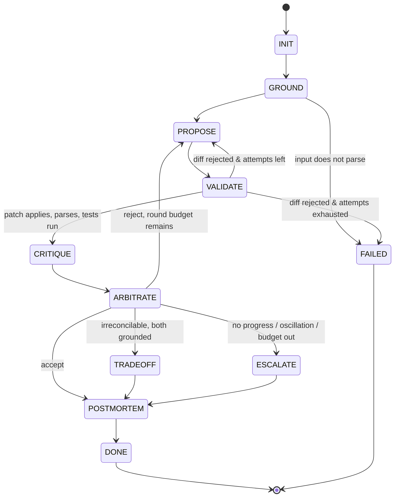

# 01 — Architecture

## Layer cake

```
┌──────────────────────────────────────────────────────────────────┐
│ Surfaces        CLI (Typer)   │   MCP server   │  trace viewer   │
├──────────────────────────────────────────────────────────────────┤
│ Orchestrator    FSM driver — owns rounds, budgets, trace emit    │
├──────────────────────────────────────────────────────────────────┤
│ Policy          DETERMINISTIC accept/reject/stop decisions       │  ← no LLM
├──────────────────────────────────────────────────────────────────┤
│ Agents          Coder │ Red-team │ Profiler │ Arbiter │ Postmort │  ← LLM
├──────────────────────────────────────────────────────────────────┤
│ Grounding       bandit │ ruff │ radon │ pytest │ timeit/cProfile │  ← no LLM
├──────────────────────────────────────────────────────────────────┤
│ Sandbox         subprocess isolation, rlimits, no network        │
├──────────────────────────────────────────────────────────────────┤
│ Infra           LLM client (cache, retries, usage) │ trace JSONL │
└──────────────────────────────────────────────────────────────────┘
```

The two rules that make this design worth writing down:

**Rule 1 — the decision layer contains no LLM.** The Arbiter agent *synthesises* and *explains*; it
does not decide. `policy.py` takes structured critiques and returns a verdict by a documented
decision table. This is why S3 in the [charter](00-charter.md) is achievable at all: the outcome is
reproducible, unit-testable, and free. It also removes the classic multi-agent failure where a
supervisor LLM is talked into accepting a bad patch by a confident worker.

**Rule 2 — critics never see each other.** Within a round, the Red-team and the Profiler get
identical inputs and cannot read each other's output. The only channel between them is the
Arbiter's consolidated critique in the *next* round. Reason: anchoring. Two LLMs shown each other's
findings converge, and convergence is exactly the signal we need to stay meaningful. Independence is
what makes agreement informative.

## The state machine



### States

| State | Actor | Does |
|---|---|---|
| `INIT` | code | Load input, hash it, open trace, seed budgets |
| `GROUND` | tools | Run the full grounding suite on the **original** file once; this is the baseline every later comparison is made against |
| `PROPOSE` | Coder (LLM) | Emit a unified diff + rationale, given the original, the grounding baseline, and (round > 1) the consolidated critique |
| `VALIDATE` | code | Deterministic gate: diff applies via `difflib`/`patch`, result parses (`ast.parse`), user test still executes, no forbidden constructs. **No LLM, no critics.** |
| `CRITIQUE` | Red-team + Profiler (LLM, parallel) | Independent structured critiques over the patched file, each grounded in fresh tool output |
| `ARBITRATE` | policy (code) then Arbiter (LLM) | Policy computes the verdict; Arbiter writes the consolidated critique or the trade-off justification for whichever branch policy chose |
| `TRADEOFF` | code | Record the accepted patch *plus* the unresolved objection and the recommended default |
| `ESCALATE` | code | Record best-effort patch (if any), the reason for stopping, and what a human should look at |
| `POSTMORTEM` | Postmortem (LLM) | Human-readable write-up from the trace |
| `DONE` / `FAILED` | — | Terminal. `FAILED` means the system could not produce anything reviewable (e.g. input doesn't parse) |

### Why `VALIDATE` exists

The original sketch went `PROPOSE → CRITIQUE`. That spends two LLM calls to discover that a diff
had the wrong line numbers. `VALIDATE` is a cheap deterministic gate that bounces malformed patches
straight back to the Coder with a mechanical error message ("hunk 2 failed to apply at line 47").
In practice this is where a large share of early-round retries get absorbed, at zero token cost, and
it keeps the critics' input distribution clean — they only ever see code that actually runs.

`VALIDATE → PROPOSE` retries are counted **separately** from debate rounds (`patch_attempts`,
default 2 per round) so that a diff-formatting stumble doesn't consume the debate budget.

## Data flow for one round

```
                    ┌─────────────┐
   original.py ────►│   GROUND    │───► GroundingReport (baseline)
                    └─────────────┘              │
                                                 ▼
  consolidated_critique (r-1) ──────────► ┌─────────────┐
  baseline ────────────────────────────►  │   Coder     │───► Patch (diff)
                                          └─────────────┘
                                                 │
                                                 ▼
                                          ┌─────────────┐
                                          │  VALIDATE   │───► patched.py  ──┐
                                          └─────────────┘                   │
                                        ┌──────────────────────┐            │
                            (parallel)  │ grounding on patched │◄───────────┘
                                        └──────────────────────┘
                                           │              │
                          ┌────────────────┘              └───────────────┐
                          ▼                                               ▼
                  ┌───────────────┐                              ┌───────────────┐
                  │   Red-team    │  ✗ no shared channel ✗       │   Profiler    │
                  └───────────────┘                              └───────────────┘
                          │  Critique                                    │  Critique
                          └────────────────┐              ┌──────────────┘
                                           ▼              ▼
                                     ┌──────────────────────────┐
                                     │  policy.decide()  (pure) │
                                     └──────────────────────────┘
                                           │        │        │
                                     REJECT│  ACCEPT│ TRADEOFF/ESCALATE
                                           ▼        ▼        ▼
                                     ┌──────────────────────────┐
                                     │  Arbiter (writes prose)  │
                                     └──────────────────────────┘
```

Every arrow in that diagram is a trace event ([06](06-observability.md)).

## Concurrency

The two critic calls are the only genuine parallelism, and they are worth doing properly:
`AsyncAnthropic` + `asyncio.gather`, with per-call timeouts and `return_exceptions=True` so one
critic failing doesn't lose the other's work. A critic that fails hard is recorded as
`status: "errored"` in the trace and the policy treats its dimension as *unassessed* — which is not
the same as *clean*, and must not be allowed to produce an accept. That distinction is a real
correctness bug waiting to happen in any parallel-critic design; it is handled explicitly in
[04](04-arbitration.md) § Unassessed dimensions.

Grounding tools also run concurrently within a dimension (`asyncio.create_subprocess_exec`), since
they are independent processes.

## Repo layout

```
tribunal/
├── pyproject.toml              # deps, entry point, ruff/pytest config
├── Dockerfile                  # runtime image (tribunal + grounding tools)
├── Dockerfile.sandbox          # minimal image for executing model-written code
├── docker-compose.yml
├── docs/                       # you are here
├── examples/                   # hand-written demo inputs for the README GIF
├── src/tribunal/
│   ├── cli.py                  # Typer: run / replay / view / eval
│   ├── config.py               # pydantic-settings: models, thresholds, budgets
│   ├── contracts.py            # ALL schemas. single source of truth
│   ├── orchestrator.py         # drives the FSM, emits trace, enforces budgets
│   ├── fsm.py                  # states, transitions, guards — no I/O
│   ├── policy.py               # deterministic verdict. pure functions only
│   ├── patch.py                # diff apply/validate, AST check
│   ├── sandbox.py              # subprocess isolation + rlimits
│   ├── agents/
│   │   ├── base.py             # render → call → parse → schema-validate → retry
│   │   ├── coder.py  redteam.py  profiler.py  arbiter.py  postmortem.py
│   ├── grounding/
│   │   ├── base.py             # GroundingTool ABC → normalised Finding list
│   │   ├── bandit_t.py  ruff_t.py  radon_t.py  pytest_t.py  perf_t.py
│   ├── llm/
│   │   ├── client.py           # AsyncAnthropic wrapper: caching, retries, usage
│   │   ├── cassette.py         # record/replay store keyed by request hash
│   │   └── prompts/*.md        # one per role, version-stamped in frontmatter
│   └── trace/
│       ├── events.py  writer.py  reader.py  viewer.py
├── eval/
│   ├── cases/NNN-slug/{before.py, test_case.py, meta.yaml}
│   ├── runner.py  judge.py  report.py
└── tests/
    ├── cassettes/              # recorded API responses → CI makes zero API calls
    ├── test_fsm.py  test_policy.py  test_patch.py  test_sandbox.py
    └── test_agents_golden.py
```

Two layout decisions worth defending:

- **`contracts.py` is one file, not a package.** Every agent, the policy, the trace and the eval
  runner all depend on the same schemas. Keeping them in one readable file makes the system's
  vocabulary visible in a single screen, which is the thing a reviewer wants to see first.
- **`fsm.py` and `policy.py` do no I/O.** They take values and return values. This is what makes
  the state machine and the decision table exhaustively unit-testable without an API key, and it is
  what makes replay possible.

## Prior art, and what to take from it

| Source | Take | Leave |
|---|---|---|
| AutoGen | Group-chat termination conditions; the idea that a conversation needs an explicit stop predicate | Free-form agent chat as the coordination primitive — message routing becomes impossible to reason about |
| CrewAI | Role/goal/backstory prompt structuring is genuinely useful scaffolding | Hidden state, implicit task delegation, and the framework owning your control flow |
| LangGraph | Explicit graph-of-states as the mental model — this project is that idea, hand-rolled | The dependency, for a graph this small |
| Constitutional AI / self-critique literature | Critique-then-revise loops improve output; critiques need criteria to be useful | Assuming the critic's judgement is sufficient without grounding |
| Human code review practice | Rejection is normal; reviewers disagree; the rationale is the artifact | — |

The hand-rolled FSM is ~200 lines. That is cheaper than learning a framework's escape hatches, and
it is the part of the project a reviewer will actually ask about.
